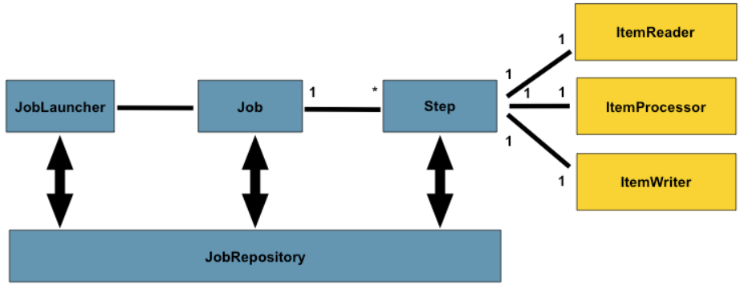
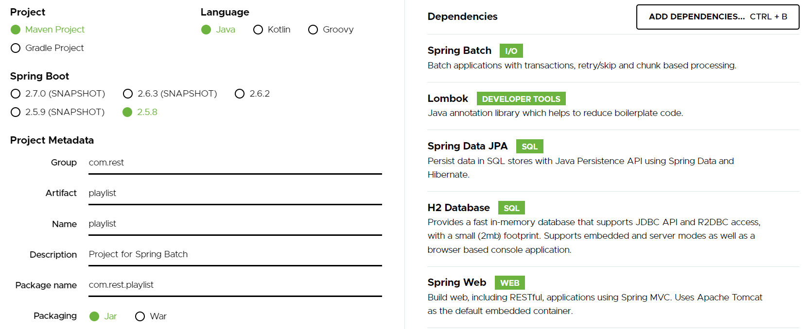
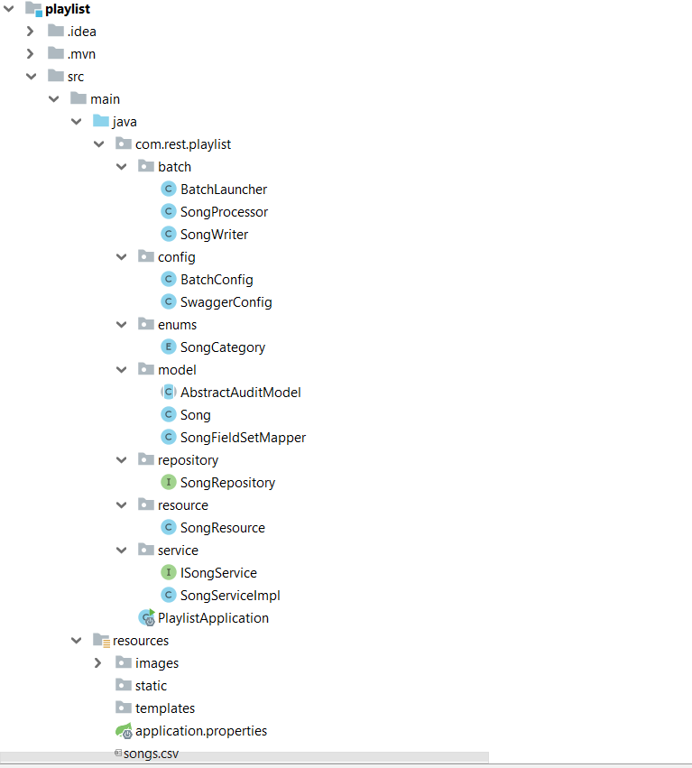
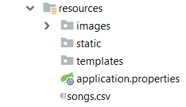
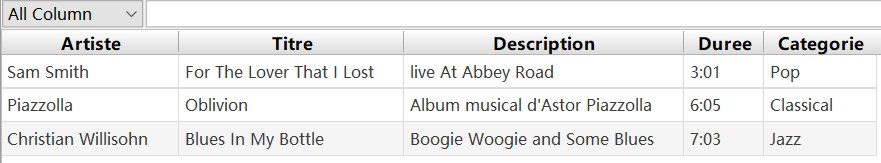
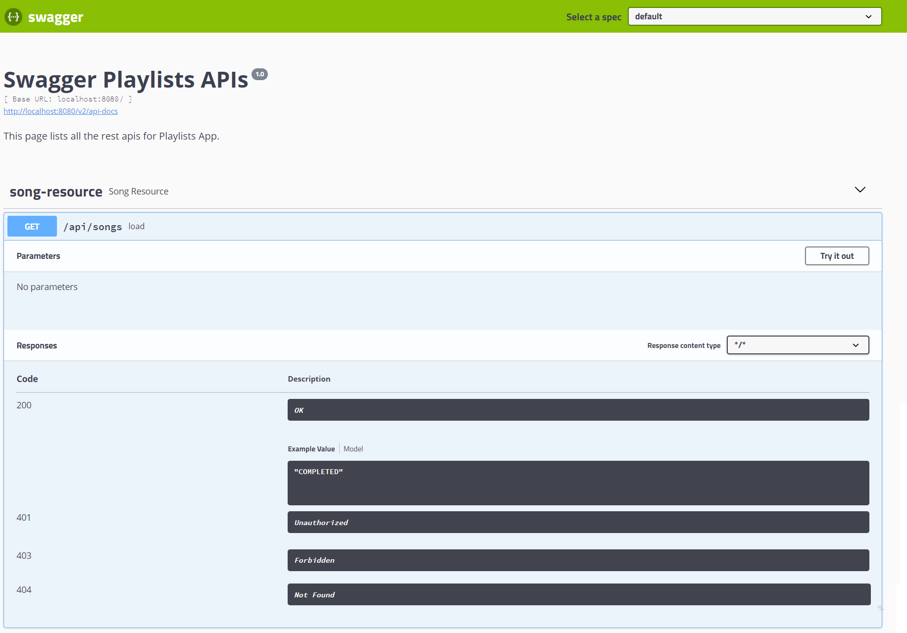
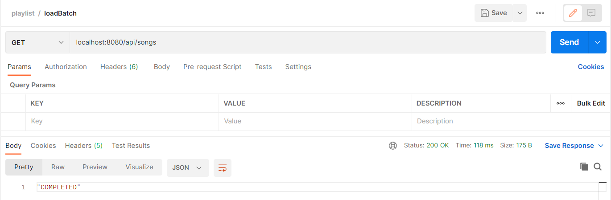
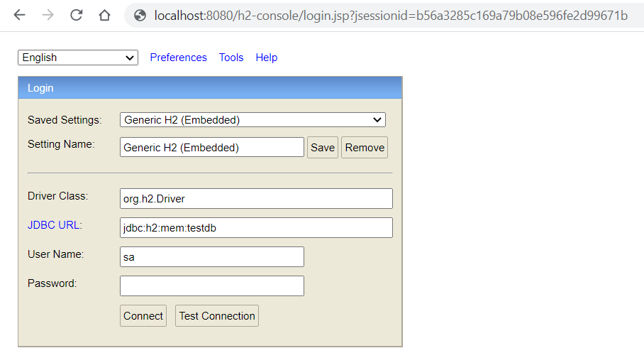
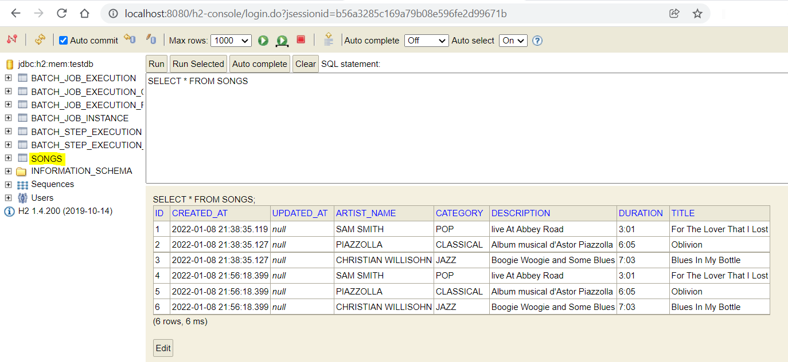

# Spring Boot avec Spring Batch - Playlists
Dans ce tutoriel, nous allons voir comment mettre spring batch en place avec Spring Boot.

##### Spring Boot
Spring Boot est un projet Spring qui facilite le processus de configuration et de publication des applications.

En suivant des étapes simples, vous pourrez exécuter votre premier projet.

##### Spring Batch
- Est un framework open source pour le traitement par lots.
- A pour but de faciliter le développement  de **batch** : **il s’agit d’un traitement sur un gros volume de données.**

##### Architecture de base de Spring Batch



Pour gérer les données d'un batch, on utilise principalement les trois outils suivants:
* Le **JobLauncher** : il s'agit du composant chargé de démarrer le programme de traitement par lot (batch = job). 

* Le **Job** : il s'agit du composant qui représente le batch à travers le Framework Spring Batch. Cette classe va pouvoir définir différentes Step au sein de son exécution avec un ordre précis.

* La **Step** : c'est le composant qui enveloppe le cœur même du besoin métier à traiter. Les Steps sont généralement stockées dans des Beans pour pouvoir y accéder facilement dans différents Job.

    * Il existe deux types de Step : type Chunk, type Tasklet.
      
    * Une **Step Chunk** est chargé de définir trois sous-composants structurés comme suit :
         * **ItemReader** : c'est le composant chargé de lire les données d'entrées à traiter de diverses sources (bases de données, fichiers plats (csv, xml, xls, etc.), queue) ;
         * **ItemProcessor** : c'est le composant responsable de la transformation des données lues. 
         * **ItemWriter** : c'est le composant responsable de sauvegarder les données transformées par le processor dans un ou plusieurs conteneurs désirés (bases de données, fichiers plats (csv, xml, xls, etc.), cloud).
   
    * Une **Step Tasklet** est une façon de faire des Steps bien plus simplement, avec moins de gestion de données. Ce type de Step existe pour permettre d’effectuer des traitements sans lecture ni écriture de données, typiquement des procédures stockées en base de données.

* Le **JobRepository** : c'est le composant chargé de stocker un grand nombre de données autour du Job. Il offre deux techniques possibles pour stocker ces statistiques : le passage par une base de données ou le passage par une Map.

##### Outils utilisés : 
* Java 8
* IDE Intellij IDEA
* Spring Boot 2.5.8 (avec Spring Web MVC, Spring Data JPA et Spring Batch)
* H2 in-memory Database
* Lombok 1.18.22
* Maven 4.0.0


## Initialisation du projet
Pour amorcer une application Spring Boot, nous pouvons démarrer le projet à partir de zéro avec notre IDE préféré, ou simplement utiliser un autre moyen qui facilite la vie : [SpringInitializr](https://start.spring.io/)

Initialement, nous avons choisi les dépendances suivantes : Spring web, Spring Batch, Spring Data JPA, Validation,H2 Database et Lombok



## Structure du projet
L'image ci-dessous montre la structure finale du projet



* **Pom.xml**

Contient des dépendances pour Spring Boot. Dans notre cas, nous avons besoin de ces dépendances.

```xml
<dependencies>
		<dependency>
			<groupId>org.springframework.boot</groupId>
			<artifactId>spring-boot-starter-batch</artifactId>
		</dependency>
		<dependency>
			<groupId>org.springframework.boot</groupId>
			<artifactId>spring-boot-starter-data-jpa</artifactId>
		</dependency>
		<dependency>
			<groupId>org.springframework.boot</groupId>
			<artifactId>spring-boot-starter-web</artifactId>
		</dependency>

		<dependency>
			<groupId>com.h2database</groupId>
			<artifactId>h2</artifactId>
			<scope>runtime</scope>
		</dependency>
		<dependency>
			<groupId>org.projectlombok</groupId>
			<artifactId>lombok</artifactId>
			<optional>true</optional>
		</dependency>
		<dependency>
			<groupId>org.springframework.boot</groupId>
			<artifactId>spring-boot-starter-test</artifactId>
			<scope>test</scope>
		</dependency>
		<dependency>
			<groupId>org.springframework.batch</groupId>
			<artifactId>spring-batch-test</artifactId>
			<scope>test</scope>
		</dependency>
        <dependency>
            <groupId>jakarta.validation</groupId>
            <artifactId>jakarta.validation-api</artifactId>
            <version>2.0.2</version>
        </dependency>
        <dependency>
            <groupId>org.apache.commons</groupId>
            <artifactId>commons-lang3</artifactId>
            <version>3.9</version>
        </dependency>
		<dependency>
			<groupId>org.hibernate</groupId>
			<artifactId>hibernate-envers</artifactId>
			<version>5.6.1.Final</version>
		</dependency>
		<dependency>
			<groupId>io.springfox</groupId>
			<artifactId>springfox-swagger2</artifactId>
			<version>2.9.2</version>
		</dependency>
		<dependency>
			<groupId>io.springfox</groupId>
			<artifactId>springfox-swagger-ui</artifactId>
			<version>2.9.2</version>
		</dependency>
	</dependencies>
```

* **Main Class**

C’est la classe principale de l’application et appelée aussi une classe de démarrage.

L ’adresse par défaut d’exécution : http://localhost:8080 

```java 
@SpringBootApplication
public class PlaylistApplication {

	public static void main(String[] args) {
		SpringApplication.run(PlaylistApplication.class, args);
	}

}
```

## II. Modèle
* **AbstractAuditModel**
Les deux modèles de l’application Playlist et Song auront des champs communs liés à l'audit tels que createdAt et updatedAt.

Il est préférable de faire abstraction de ces champs communs dans une classe de base distincte appelée AbstractAuditModel. Cette classe sera étendue par d'autres entités.

**@EntityListeners(AuditingEntityListener.class)** : les valeurs de createdAt et updatedAt seront automatiquement renseignées lorsque les entités seront conservées.

**@MappedSuperclass.java**

En utilisant la stratégie MappedSuperclass, l'héritage n'est évident que dans la classe mais pas dans le modèle d'entité. Il faut noter que cette classe n'a plus d’annotation @Entity, car elle ne sera pas conservée seule dans la base de données.

```java
@Audited
@MappedSuperclass
@EntityListeners(AuditingEntityListener.class)
public abstract class AbstractAuditModel implements Serializable {

    @CreatedDate
    @JsonIgnore
    @Column(name = "created_at", nullable = false, updatable = false)
    private Instant createAt = Instant.now();

    @LastModifiedDate
    @JsonIgnore
    @Column(name = "updated_at")
    private Instant updatedAt;

    public Instant getCreateAt() {
        return createAt;
    }

    public void setCreateAt(Instant createAt) {
        this.createAt = createAt;
    }

    public Instant getUpdatedAt() {
        return updatedAt;
    }

    public void setUpdatedAt(Instant updatedAt) {
        this.updatedAt = updatedAt;
    }
}
```
**@EnableJpaAuditing** : Pour activer l'audit JPA (dans la classe de repository)

* **Song.java**

L’entité « Song » est mappé à une table nommée « songs » dans la base de données

- l'annotation **@Entity** indique que la classe est une classe Java persistante.

– l'annotation **@Table** fournit la table qui mappe cette entité.

– l'annotation **@Id** est pour la clé primaire.

– l'annotation **@GeneratedValue** est utilisée pour définir la stratégie de génération de la clé primaire. **GenerationType.SEQUENCE** signifie la génération de la clé primaire se fera par une séquence définie dans le SGBD, auquel on ajoute l’attribut generator.

– l'annotation **@Column** est utilisée pour définir la colonne dans la base de données qui mappe le champ annoté.
  
Ici, nous allons utiliser **Lombok** : est une bibliothèque Java qui se connecte automatiquement à un éditeur afin de générer automatiquement les méthodes getter ou equals à l'aide des annotations.
  
* **@Getter / @Setter** :  pour générer automatiquement le getter/setter par défaut.

```java
@Entity
@Getter
@Setter
@Table(name = "songs")
public class Song extends AbstractAuditModel{

    @Id
    @GeneratedValue(strategy = GenerationType.SEQUENCE, generator = "SONG_SEQ")
    @SequenceGenerator(name = "SONG_SEQ", sequenceName = "song_seq", allocationSize = 1)
    private Long id;

    @Column(name = "title")
    @NotBlank(message = "titre ne doit pas être null ou vide")
    @Size(min = 3, max = 50, message = "titre doit être compris entre 3 et 50 caractères")
    private String title;

    @Column(name = "description")
    @NotBlank(message = "description ne doit pas être nulle ou vide")
    @Size(min = 3, max = 50, message = "description doit être compris entre 3 et 50 caractères")
    private String description;

    @Column(name = "duration")
    @NotBlank(message = "duration ne doit pas être nulle ou vide")
    private String duration;

    @Column(name = "artist_name")
    @NotBlank(message = "artistname ne doit pas être null ou vide")
    private String artistName;

    @Column(name = "category")
    @Enumerated(EnumType.STRING)
    @NotNull(message = "categorie<JAZZ, POP, CLASSICAL> ne doit pas être nulle")
    private SongCategory category;
}
```

* **SongFieldSetMapper**

Cette calsse s'agit de transformer les données en objet métier à travers l'objet **FieldSet**.

```java
public class SongFieldSetMapper implements FieldSetMapper<Song> {

    @Override
    public Song mapFieldSet(FieldSet fieldSet) {
        Song song = new Song();
        song.setArtistName(fieldSet.readString(0));
        song.setTitle(fieldSet.readString(1));
        song.setDescription(fieldSet.readString(2));
        song.setDuration(fieldSet.readString(3));
        SongCategory searchedCategory = EnumUtils.getEnumIgnoreCase(SongCategory.class, fieldSet.readString(4).toUpperCase());
        if (searchedCategory != null) {
            song.setCategory(searchedCategory);
        }
        return song;
    }
}
```
### III. enums
La classe « **SongCategory** » contient les différentes valeurs possibles d’une catégorie.

```java 
public enum SongCategory {
    JAZZ,
    CLASSICAL,
    POP
}
```
## III. Reposirory
Spring framework nous fournit des repositories afin d’encapsuler des détails de la couche de persistance et de fournir une interface CRUD pour une seule entité ⇒ la possibilité de générer toutes sortes d'opérations vers la base de données.

**Spring Data JPA** est le module qui nous permet d’interagir avec une base de données relationnelles en représentant les objets du domaine métier sous la forme d’entités JPA.

L’annotation **@Repository** est une spécialisation de l’annotation **@Component** ⇒ Pour indiquer que la classe définit un référentiel de données

* **SongRepository.java**

Cette interface est utilisée pour accéder aux chansons de la base de données et qui s'étend de JpaRepository.

Avec **JpaRepository**, nous pouvons :

 * Bénéficier automatiquement des méthodes héritées tels que : **findAll(), findById()** …

```java
@Repository
@EnableJpaAuditing
public interface SongRepository extends JpaRepository<Song, Long> {
}
```
## IV. Service
* **ISongService**

```java
public interface ISongService {
    void createSong(Song song);
}
```
* **SongServiceImpl**

L'annotation **@Transactional** peut être utilisée pour indiquer au conteneur les méthodes qui doivent s'exécuter dans un contexte transactionnel.

```java
@Service
@Transactional
public class SongServiceImpl implements ISongService {
    private static final Logger log = LoggerFactory.getLogger(SongServiceImpl.class);

    private final SongRepository songRepository;

    public SongServiceImpl(SongRepository songRepository) {
        this.songRepository = songRepository;
    }

    @Override
    public void createSong(Song song) {
        songRepository.save(song);
    }

}
```
## V. Fichier Songs.csv
Ce fichier existe sous le dossier resources



## VI. Configuration du Job, de la Step et la définition du Reader, du Processor, du Writer
**@EnableBatchProcessing** : cette annotation est utilisée pour activer le traitement par lots.

Nous devons par la suite créer un reader pour lire notre fichier CSV, créer un processor pour traiter les données d'entrée avant d'écrire, créer un writer pour écrire dans la base de données.
 
 * **Configuration de la Step**
Chaque step peut impliquer un reader, un processor et un writer.

On peut aussi définir la quantité de données à écrire à la fois et dans notre exemple, nous avons mis jusqu'à 5 enregistrements à la fois : **chunk(5)**

**stepBuilderFactory** : sert à définir automatiquement le JobRepository et PlatformTransactionManager.
 ```
  @Bean
    public Step songStep() {
        return stepBuilderFactory.get(STEP_NAME)
                .<Song, Song>chunk(5)
                .reader(songItemReader())
                .processor(songItemProcessor())
                .writer(studentItemWriter())
                .build();
    }
```
 * **Configuration de Job**
 Les jobs sont créés à partir une ou plusieurs steps.
 
La step **songStep** sera exécutée par le job **listSongsJob**.

**jobBuilderFactory** : sert à définir automatiquement le JobRepository.
 ```
@Bean
    public Job listSongsJob(Step stepBatch) {
        return jobBuilderFactory.get(JOB_NAME)
                .start(stepBatch)
                .build();
    }
```

* **Définition du Reader**
Le Reader lit une source de données et est appelé successivement au sein d'une étape et retourne des objets pour lequel il est défini (Song dans notre cas).
```
@Bean
    public ItemReader<Song> songItemReader() {
        FlatFileItemReader<Song> reader = new FlatFileItemReader<>();
        reader.setResource(new ClassPathResource(FILE_NAME));
        reader.setName(READER_NAME);
        reader.setLinesToSkip(1);
        reader.setLineMapper(lineMapper());
        return reader;

    }
```
 * La méthode **lineMapper()** : est utilisée pour mapper des lignes (chaînes) vers des objets généralement utilisée pour mapper des lignes lues à partir d'un fichier

 * **DelimitedLineTokenizer** sert à décomposer chaque ligne dans un objet FieldSet 

 * la propriété **names** donne le format de l'entête du fichier et permet d'identifier les données de chaque ligne. 
 
 * La configuration complète dans la classe **BatchConfig.java**
```java
@Configuration
@EnableBatchProcessing
public class BatchConfig {

    @Value("${header.names}")
    private String names;

    @Value("${line.delimiter}")
    private String delimiter;

    private static final String FILE_NAME = "songs.csv";
    private static final String JOB_NAME = "listSongsJob";
    private static final String STEP_NAME = "processingStep";
    private static final String READER_NAME = "songItemReader";

    private JobBuilderFactory jobBuilderFactory;
    private StepBuilderFactory stepBuilderFactory;

    public BatchConfig(JobBuilderFactory jobBuilderFactory, StepBuilderFactory stepBuilderFactory) {
        this.jobBuilderFactory = jobBuilderFactory;
        this.stepBuilderFactory = stepBuilderFactory;
    }

    @Bean
    public Job listSongsJob(Step stepBatch) {
        return jobBuilderFactory.get(JOB_NAME)
                .start(stepBatch)
                .build();
    }

    @Bean
    public Step studentStep() {
        return stepBuilderFactory.get(STEP_NAME)
                .<Song, Song>chunk(5)
                .reader(songItemReader())
                .processor(songItemProcessor())
                .writer(studentItemWriter())
                .build();
    }

    @Bean
    public ItemReader<Song> songItemReader() {
        FlatFileItemReader<Song> reader = new FlatFileItemReader<>();
        reader.setResource(new ClassPathResource(FILE_NAME));
        reader.setName(READER_NAME);
        reader.setLinesToSkip(1);
        reader.setLineMapper(lineMapper());
        return reader;

    }

    @Bean
    public ItemProcessor<Song, Song> songItemProcessor() {
        return new SongProcessor();
    }

    @Bean
    public ItemWriter<Song> studentItemWriter() {
        return new SongWriter();
    }

    @Bean
    public LineMapper<Song> lineMapper() {

        final DefaultLineMapper<Song> defaultLineMapper = new DefaultLineMapper<>();
        final DelimitedLineTokenizer lineTokenizer = new DelimitedLineTokenizer();
        lineTokenizer.setDelimiter(delimiter);
        lineTokenizer.setStrict(false);
        lineTokenizer.setNames(names.split(delimiter));

        final SongFieldSetMapper fieldSetMapper = new SongFieldSetMapper();
        defaultLineMapper.setLineTokenizer(lineTokenizer);
        defaultLineMapper.setFieldSetMapper(fieldSetMapper);

        return defaultLineMapper;
    }
}
```

 * **Définition du Processor** : **SongProcessor.java** sous package "**batch**"
    * Un processor est utilisé pour les implémentations de besoins fonctionnels.
    
    * Il n'est pas obligatoire et on peut s'en passer si aucun besoin fonctionnel n'est prévu dans notre traitement.
    
    * Dans notre cas, on va écrire un simple processor qui va convertir le nom de l'artiste de notre objet song en majuscules 
 ```java
public class SongProcessor implements ItemProcessor<Song, Song> {

    @Override
    public Song process(Song song) {
        song.setArtistName(song.getArtistName().toUpperCase());
        return song;
    }
}
```

* **Définition du Writer** : **SongWriter** sous package "**batch**"
    * Le Writer écrit les données provenant du processor (ou directement lues par le Reader). 
    
    * Il reçoit du processor les objets transformés et chaque objet sera par la suite persisté dans notre base de donnés et transaction sera validée.
```java
@Slf4j
public class SongWriter implements ItemWriter<Song> {
    private ISongService songService;

    public SongWriter(ISongService songService) {
        this.songService = songService;
    }

    @Override
    public void write(List<? extends Song> songs) {
        songs.stream().forEach(song -> {
            log.info("Enregistrement en base de l'objet {}", song);
            songService.createSong(song);
        });
    }
}
```
* **BatchLauncher.java** : Le lancement du main, va démarrer notre job et le batch launcher se présente comme suit :
```java
@Component
public class BatchLauncher {

    private JobLauncher jobLauncher;
    private Job job;

    public BatchLauncher(JobLauncher jobLauncher, Job job) {
        this.jobLauncher = jobLauncher;
        this.job = job;
    }

    public BatchStatus run() throws JobParametersInvalidException, JobExecutionAlreadyRunningException, JobRestartException, JobInstanceAlreadyCompleteException {
        JobParameters parameters = new JobParametersBuilder().addLong("time", System.currentTimeMillis()).toJobParameters();
        JobExecution jobExecution = jobLauncher.run(job, parameters);
        return jobExecution.getStatus();
    }
}
```
* **Fichier de configuration du batch (application.properties)**

```
# Enabling H2 Console
spring.h2.console.enabled=true

# To See H2 Console in Browser:
spring.h2.console.path=/h2-console
spring.h2.console.settings.web-allow-others=true

# ===============================
# DB
# ===============================
        
spring.datasource.url=jdbc:h2:mem:testdb
spring.datasource.driverClassName=org.h2.Driver
spring.datasource.username=sa
spring.datasource.password=
spring.jpa.database-platform=org.hibernate.dialect.H2Dialect

# ===============================
# JPA / HIBERNATE
# ===============================

spring.jpa.show-sql=true
spring.jpa.hibernate.ddl-auto=update
spring.jpa.properties.hibernate.dialect=org.hibernate.dialect.H2Dialect

header.names= Artise,Titre,Description,Duree,Categorie
line.delimiter=,

logging.level.org.springframework.web=ERROR
logging.level.com.rest=DEBUG
```

## VII. Resource
* **SongResource**

Ce contrôleur expose une API pour appeler le Job Spring Batch

– l'annotation **@RestController** est utilisée pour définir un contrôleur.

⇒ **@RestController** remplace principalement :

   * **@Controller** : pour dire que c'est un controlleur, pour que spring le charge dans son context, et pour le rendre singleton.

   * **@ResponseBody** : pour indiquer que la valeur de retour des méthodes doit être liée au corps de la réponse Web.

**@RequestMapping("/api/songs")** déclare que toutes les URL d'Apis dans le contrôleur commenceront par /api/songs.

– Nous avons injecté la classe **batchLauncher** par constructeur.

```java
@Slf4j
@RestController
@RequestMapping("/api/songs")
public class SongResource {

    private BatchLauncher batchLauncher;

    public SongResource(BatchLauncher batchLauncher) {
        this.batchLauncher = batchLauncher;
    }


    @GetMapping
    public BatchStatus load() throws JobParametersInvalidException, JobExecutionAlreadyRunningException, JobRestartException, JobInstanceAlreadyCompleteException {
        log.info("Batch demarré à la demande");
        return batchLauncher.run();
    }

}
```
## VIII. Documentation des API Spring Rest à l'aide de Swagger : Package « config »
Swagger est le framework d'API le plus populaire avec une prise en charge de plus de 40 langues différentes. Nous pouvons utiliser swagger pour concevoir, construire et documenter nos REST API.

```java
@Configuration
@EnableSwagger2
public class SwaggerConfig {

    @Bean
    public Docket api() {

        return new Docket(DocumentationType.SWAGGER_2)
                .apiInfo(apiInfo())
                .select()
                .apis(RequestHandlerSelectors.any())
                .paths(paths()::test)
                .build();

    }

    private ApiInfo apiInfo() {
        return new ApiInfoBuilder()
                .title("Swagger Playlists APIs")
                .description("This page lists all the rest apis for Playlists App.")
                .version("1.0")
                .build();
    }

    private Predicate<String> paths() {
        return ((Predicate<String>) regex("/error.*")::apply).negate()
                .and(regex("/.*")::apply);
    }
}
```

Cliquer sur ce lien pour accéder à [SwaggerUi](http://localhost:8080/swagger-ui.html)



## IX. Exécution et Test de l'application

* Pour tester la requête "**loadBatch**" de l’application, vous devez importer le fichier « **Playlists.postman_collection.json** » qui existe sous le dossier resources/postman.



* Pour s'assurer que la console H2console a déjà démarré lors du lancement de l'application spring batch et la base de données est automatiquement générée ainsi que la creation de la table Song.

Cliquer sur ce lien pour accéder à [H2Console](http://localhost:8080/h2-console/)



